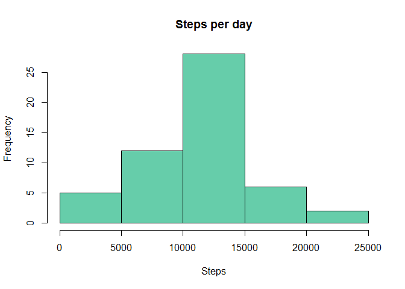
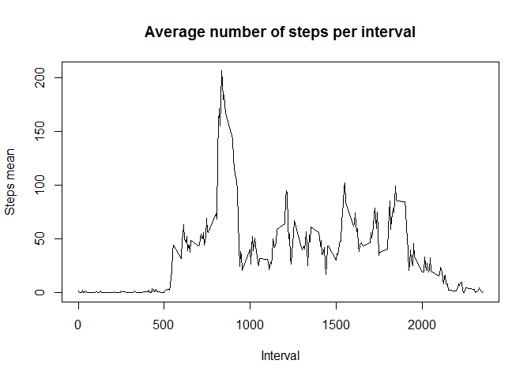
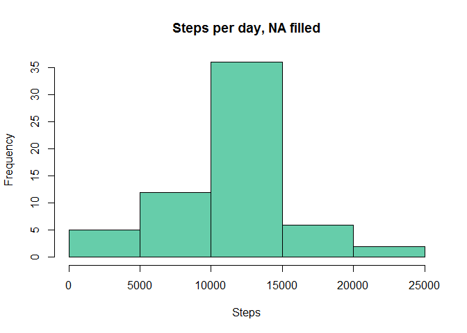
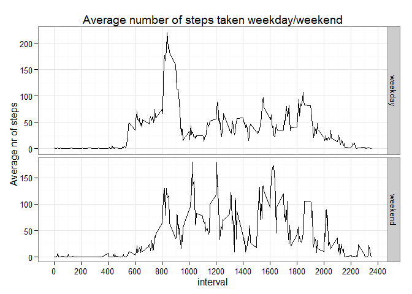

# Reproducible Research: Peer Assessment 1


## Loading and preprocessing the data

The research data set zip file should be in the current working directory or it will be downloaded and unzipped to the current working directory from the [webpage][1].

Remember to set the working directory.
Printed values are rouned to two decimals.


```r
# Disable scientific notation.
options(scipen=999)

setwd("~/R Projects/Coursera/5 - Reproducible Research/RepData_PeerAssessment1")
rm(list=ls())

# Load packages
library(dplyr)
```

```
## Warning: package 'dplyr' was built under R version 3.2.2
```

```
## 
## Attaching package: 'dplyr'
## 
## The following objects are masked from 'package:stats':
## 
##     filter, lag
## 
## The following objects are masked from 'package:base':
## 
##     intersect, setdiff, setequal, union
```

```r
library(ggplot2)
```

```
## Warning: package 'ggplot2' was built under R version 3.2.2
```


```r
# Download uri.
data.url <- "https://d396qusza40orc.cloudfront.net/repdata%2Fdata%2Factivity.zip"
data.url <- gsub("%2F", "/", data.url)

file.zip <- "activity.zip"
file.data <- "activity.csv"

# Download file if missing.
if (!file.exists(file.zip)){
  message("Downloading file into: ", getwd())
  download.file(data.url, file.zip, method = "auto", mode="wb") # Don't use curl on Windows.
  unzip(file.zip)
}

# Load into df and set correct column types. Remove NA's.
activity <- read.csv(file.data) %>%
  mutate(date = as.Date(date)) %>%
  mutate(steps = as.integer(steps)) %>%
  mutate(interval = as.integer(interval))
```

## What is mean total number of steps taken per day?

Before creating a histogram remove NA values and group data frame by date. Apply
the sum() function to $steps.


```r
summ.byDate <- activity %>%
  na.omit() %>% # 15264 left
  group_by(date) %>%
  summarise(
    steps = sum(steps))
```

Draw a histogram for steps.


```r
hist(summ.byDate$steps,
     col = "aquamarine3",
     main="Steps per day",
     xlab="Steps")
```

 

Calculate the mean and median for values.


```r
steps.mean <- mean(summ.byDate$steps)
steps.median <- median(summ.byDate$steps)
```

The *mean* total number of steps taken per day is 10766.19 and the 
*median* is 10765.

## What is the average daily activity pattern?

Remove NA's and calculate the mean of steps over all days by time interval.


```r
average.byInterval <- activity %>%
  na.omit() %>% # 15264 left
  group_by(interval) %>%
  summarise(
    steps = mean(steps))
```

Plot the results as time series.


```r
plot(average.byInterval$interval, average.byInterval$step,
  type="l",
  main="Average number of steps per interval",
  xlab="Interval", 
  ylab="Steps mean"
)
```

 


Find interval which contains the maximum of steps. The result is a frame of
interval and steps. Because there can be multiple rows with results (max value is
in more than one interval) and the conflict resolving strategy is not specified 
only the first result is taken.


```r
average.Max <- average.byInterval  %>%
  filter(steps == max(steps)) %>%
  filter(row_number() == 1)

average.Max$interval
```

```
## [1] 835
```

```r
average.Max$steps
```

```
## [1] 206.1698
```

The interval with the maximum amount of steps is 
835 
and the average number of steps inside that interval is 
206.17.

## Imputing missing values

The total number of missing values in the data set (i.e. the total number of rows with NAs).
Filter NA rows and count the number of observations in the current group with n().
Fix the column name in resulting frame.


```r
nas.cnt <- activity  %>%
  filter(is.na(steps)) %>%
  summarise(n()) %>%
  rename(n = `n()`)
nas.cnt$n
```

```
## [1] 2304
```

There are 2304 NA values in the set.


### Filling minning values ###

The strategy uses already calculated values inside the frame is 
to replace the missing values by the mean value from the given interval, like
inside the *average.byInterval* data frame..

Note: replace is a faster alternative for ifelse syntax is different for dplyr, *replace(x, list, values)*.
New data set now looks like:


```r
activity.filled <- activity  %>%
  group_by(interval) %>%
  mutate(steps = replace(steps, is.na(steps), mean(steps, na.rm=TRUE)))

head(activity.filled)
```

```
## Source: local data frame [6 x 3]
## Groups: interval [6]
## 
##       steps       date interval
##       (dbl)     (date)    (int)
## 1 1.7169811 2012-10-01        0
## 2 0.3396226 2012-10-01        5
## 3 0.1320755 2012-10-01       10
## 4 0.1509434 2012-10-01       15
## 5 0.0754717 2012-10-01       20
## 6 2.0943396 2012-10-01       25
```

New sum of steps calculated with NA values replaced by mean.


```r
summ.byDateFilled <- activity.filled %>%
  group_by(date) %>%
  summarise(
    steps = sum(steps))
```

Draw a histogram for steps with new NA's.


```r
hist(summ.byDateFilled$steps,
     col = "aquamarine3",
     main="Steps per day, NA filled",
     xlab="Steps")
```

 

Calculate the mean and median for values.


```r
stepsFilled.mean <- mean(summ.byDateFilled$steps)
stepsFilled.median <- median(summ.byDateFilled$steps)
```

The *mean* total number of steps taken per day has changed form 
10766.1887 to 
10766.1887 
and the *median* is changed from 
10765 to 
10766.1887.
Basically, the median of data is changed but mean remain the same.
Char shows that data distribution is around the center.


## Are there differences in activity patterns between weekdays and weekends?

Add new column *day* with Weekday as a decimal number (1-7, Monday is 1). Then
replace day numbers >6 with *weekend* and other days with *weekday*. Filled NA values
are used. Data is now:


```r
activityFilled_days <- activity.filled  %>%
  mutate(day = strftime(date,'%u')) %>%
  mutate(day = ifelse(day > 6, "weekend", "weekday")) %>%
  select(steps, interval, day) %>%
  group_by(interval, day) %>%
  summarise(steps = mean(steps))

head(activityFilled_days)
```

```
## Source: local data frame [6 x 3]
## Groups: interval [3]
## 
##   interval     day      steps
##      (int)   (chr)      (dbl)
## 1        0 weekday 1.94375222
## 2        0 weekend 0.21462264
## 3        5 weekday 0.38447846
## 4        5 weekend 0.04245283
## 5       10 weekday 0.14951940
## 6       10 weekend 0.01650943
```

Plot data using ggplot2 with horizontal facets. Because ticks are basically the time.
2355 = 23:55) manual X-axis scale is used with a major tick of 200 (2 hours). The 
minor tick is automatically set to 1H.


```r
days.plot <-
  ggplot(activityFilled_days, aes(interval, steps, fill=steps)) +
  geom_freqpoly(stat="identity") + 
  theme_bw() + # White background with grid lines.
  guides( fill=FALSE ) + # skip legend.
  facet_grid(day~., scales = "free", space="free") +
  labs(x = "interval", y = "Average nr of steps") + 
  labs(title = "Average number of steps taken weekday/weekend") +
  scale_x_continuous(breaks = seq(0, 2400, 200)) + # Manual axis ticks.
  theme(text = element_text(size=12)) # Smaller font or will overlap in file.

print(days.plot) # screen, Plots tab.
```

 

There are there differences in activity patterns between weekdays and weekends.
During the weekdays people are starting activity earlier and there is a top activity
around 08:00.
There is also an evening activity during the weekends, probably evening walk.

[1]: https://d396qusza40orc.cloudfront.net/repdata%2Fdata%2Factivity.zip
